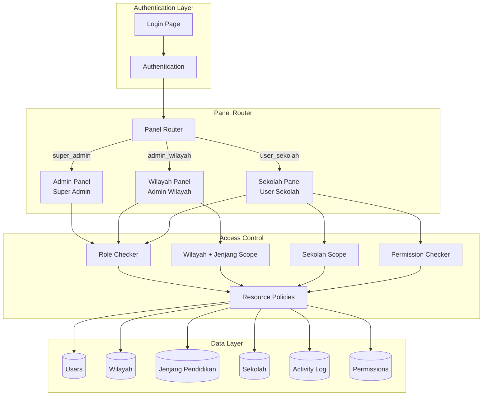
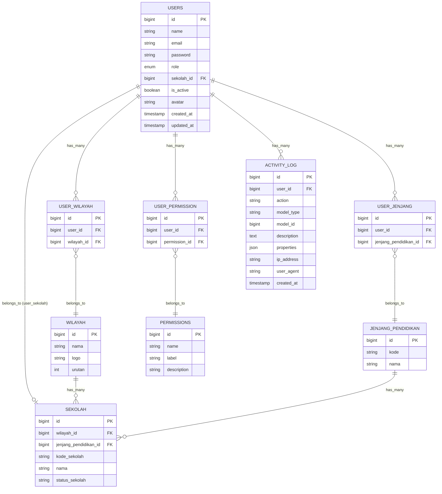

# Design Document: Multi-Panel User Management System

## Overview

Sistem Multi-Panel User Management akan mengimplementasikan pemisahan akses antara tiga jenis pengguna menggunakan Filament Multi-Panel architecture:

1. **Super Admin** - Admin Panel dengan akses penuh ke semua data dan fitur
2. **Admin Wilayah** - Wilayah Panel dengan akses terbatas berdasarkan wilayah DAN jenjang pendidikan yang ditugaskan
3. **User Sekolah** - Sekolah Panel dengan akses terbatas pada data sekolah sendiri dan fitur yang dikonfigurasi

Sistem ini dibangun di atas Laravel 12 dengan Filament 4.0, memanfaatkan fitur multi-panel, policies, global scopes, dan permission system untuk implementasi access control yang robust.

## Architecture



## Components and Interfaces

### 1. User Model Extension

```php
// app/Models/User.php
interface UserInterface
{
    // Role checks
    public function isSuperAdmin(): bool;
    public function isAdminWilayah(): bool;
    public function isUserSekolah(): bool;

    // Panel access
    public function canAccessPanel(Panel $panel): bool;

    // Relationships
    public function wilayahs(): BelongsToMany;  // Multiple wilayah untuk Admin Wilayah
    public function jenjangs(): BelongsToMany;  // Multiple jenjang untuk Admin Wilayah
    public function sekolah(): BelongsTo;       // Single sekolah untuk User Sekolah
    public function permissions(): BelongsToMany;

    // Helpers
    public function hasPermission(string $permission): bool;
    public function getWilayahIds(): array;
    public function getJenjangIds(): array;
}
```

### 2. Panel Providers

**AdminPanelProvider** (existing, modified):

-   Path: `/admin`
-   Access: Hanya untuk `super_admin`
-   Resources: Semua resources tanpa filter
-   Features: User Management, Backup Manager, Activity Log

**WilayahPanelProvider** (new):

-   Path: `/wilayah`
-   Access: Hanya untuk `admin_wilayah`
-   Resources: Resources dengan filter wilayah + jenjang
-   Features: Dashboard, Sekolah, Pelaksanaan Asesmen, Request Download

**SekolahPanelProvider** (new):

-   Path: `/sekolah`
-   Access: Hanya untuk `user_sekolah`
-   Resources: Resources dengan filter sekolah sendiri
-   Features: Dikonfigurasi via permissions

### 3. Middleware

```php
// app/Http/Middleware/EnsureUserHasRole.php
interface RoleMiddleware
{
    public function handle(Request $request, Closure $next, string ...$roles): Response;
}

// app/Http/Middleware/ApplyWilayahJenjangScope.php
interface WilayahJenjangScopeMiddleware
{
    public function handle(Request $request, Closure $next): Response;
}

// app/Http/Middleware/ApplySekolahScope.php
interface SekolahScopeMiddleware
{
    public function handle(Request $request, Closure $next): Response;
}

// app/Http/Middleware/CheckPermission.php
interface PermissionMiddleware
{
    public function handle(Request $request, Closure $next, string $permission): Response;
}
```

### 4. Global Scopes

```php
// app/Models/Scopes/WilayahJenjangScope.php
class WilayahJenjangScope implements Scope
{
    public function apply(Builder $builder, Model $model): void
    {
        if (auth()->user()?->isAdminWilayah()) {
            $builder->whereIn('wilayah_id', auth()->user()->getWilayahIds())
                    ->whereIn('jenjang_pendidikan_id', auth()->user()->getJenjangIds());
        }
    }
}

// app/Models/Scopes/SekolahScope.php
class SekolahScope implements Scope
{
    public function apply(Builder $builder, Model $model): void
    {
        if (auth()->user()?->isUserSekolah()) {
            $builder->where('sekolah_id', auth()->user()->sekolah_id);
        }
    }
}
```

### 5. Permission System

```php
// app/Models/Permission.php
class Permission extends Model
{
    // Available permissions for User Sekolah
    const VIEW_SEKOLAH_DATA = 'view_sekolah_data';
    const VIEW_ASESMEN_DATA = 'view_asesmen_data';
    const DOWNLOAD_REPORT = 'download_report';
    const VIEW_STATISTICS = 'view_statistics';
}
```

## Data Models

### Database Migrations

**1. Modify Users Table**

```php
Schema::table('users', function (Blueprint $table) {
    $table->enum('role', ['super_admin', 'admin_wilayah', 'user_sekolah'])->default('user_sekolah');
    $table->foreignId('sekolah_id')->nullable()->constrained('sekolah')->nullOnDelete();
    $table->boolean('is_active')->default(true);
});
```

**2. Create User-Wilayah Pivot Table**

```php
Schema::create('user_wilayah', function (Blueprint $table) {
    $table->id();
    $table->foreignId('user_id')->constrained()->cascadeOnDelete();
    $table->foreignId('wilayah_id')->constrained('wilayah')->cascadeOnDelete();
    $table->timestamps();

    $table->unique(['user_id', 'wilayah_id']);
});
```

**3. Create User-Jenjang Pivot Table**

```php
Schema::create('user_jenjang', function (Blueprint $table) {
    $table->id();
    $table->foreignId('user_id')->constrained()->cascadeOnDelete();
    $table->foreignId('jenjang_pendidikan_id')->constrained('jenjang_pendidikan')->cascadeOnDelete();
    $table->timestamps();

    $table->unique(['user_id', 'jenjang_pendidikan_id']);
});
```

**4. Create Permissions Table**

```php
Schema::create('permissions', function (Blueprint $table) {
    $table->id();
    $table->string('name')->unique();
    $table->string('label');
    $table->string('description')->nullable();
    $table->timestamps();
});
```

**5. Create User-Permission Pivot Table**

```php
Schema::create('user_permission', function (Blueprint $table) {
    $table->id();
    $table->foreignId('user_id')->constrained()->cascadeOnDelete();
    $table->foreignId('permission_id')->constrained()->cascadeOnDelete();
    $table->timestamps();

    $table->unique(['user_id', 'permission_id']);
});
```

### Entity Relationship Diagram



## Correctness Properties

_A property is a characteristic or behavior that should hold true across all valid executions of a system-essentially, a formal statement about what the system should do. Properties serve as the bridge between human-readable specifications and machine-verifiable correctness guarantees._

### Property 1: Admin Wilayah Data Isolation

_For any_ Admin Wilayah user dan _for any_ query ke data sekolah, pelaksanaan asesmen, atau request download, hasil query SHALL hanya berisi record yang memiliki `wilayah_id` dalam daftar wilayah user DAN `jenjang_pendidikan_id` dalam daftar jenjang user.

**Validates: Requirements 2.2, 2.3, 2.5, 2.6**

### Property 2: User Sekolah Data Isolation

_For any_ User Sekolah dan _for any_ query ke data sekolah atau pelaksanaan asesmen, hasil query SHALL hanya berisi record yang memiliki `sekolah_id` sama dengan `sekolah_id` user tersebut.

**Validates: Requirements 3.2, 3.3**

### Property 3: Super Admin Full Access

_For any_ Super Admin user dan _for any_ query ke data apapun, hasil query SHALL berisi semua record tanpa filter wilayah, jenjang, atau sekolah.

**Validates: Requirements 1.2, 1.3, 1.5**

### Property 4: Role-Based Panel Access

_For any_ user:

-   Jika role = `super_admin`, user SHALL dapat mengakses Admin Panel
-   Jika role = `admin_wilayah`, user SHALL di-redirect ke Wilayah Panel saat mengakses Admin Panel
-   Jika role = `user_sekolah`, user SHALL di-redirect ke Sekolah Panel saat mengakses Admin Panel atau Wilayah Panel

**Validates: Requirements 6.1, 6.2, 6.3, 6.4**

### Property 5: Permission-Based Feature Access

_For any_ User Sekolah dan _for any_ fitur yang memerlukan permission, user SHALL hanya dapat mengakses fitur jika memiliki permission yang sesuai dalam tabel `user_permission`.

**Validates: Requirements 3.5, 5.2**

### Property 6: Activity Logging Completeness

_For any_ operasi login, logout, approve, reject, backup, restore, create user, update user, atau delete user yang berhasil, sistem SHALL membuat entry di Activity Log dengan `user_id`, `action`, `ip_address`, dan `user_agent` yang valid.

**Validates: Requirements 7.1, 7.2, 7.3, 7.4**

### Property 7: User Deactivation Enforcement

_For any_ user dengan `is_active = false`, attempt untuk login SHALL gagal dengan pesan error yang sesuai, terlepas dari role user tersebut.

**Validates: Requirements 4.3, 5.3**

### Property 8: Password Change Validation

_For any_ request perubahan password, sistem SHALL memvalidasi bahwa password lama cocok sebelum menyimpan password baru yang di-hash.

**Validates: Requirements 8.2**

### Property 9: User CRUD with Logging

_For any_ operasi create, update, atau delete pada User oleh Super Admin, sistem SHALL menyimpan perubahan dan mencatat aktivitas di Activity Log dengan detail operasi.

**Validates: Requirements 4.5, 5.5**

### Property 10: Cross-Boundary Access Denial

_For any_ Admin Wilayah yang mencoba mengakses data di luar wilayah atau jenjang yang ditugaskan, DAN _for any_ User Sekolah yang mencoba mengakses data sekolah lain, sistem SHALL menolak akses dengan response 403 Forbidden.

**Validates: Requirements 2.4, 3.4**

## Error Handling

### Authentication Errors

| Error              | Condition                   | Response                                                       |
| ------------------ | --------------------------- | -------------------------------------------------------------- |
| InvalidCredentials | Email/password salah        | Redirect ke login dengan pesan error                           |
| UserInactive       | User dengan is_active=false | Redirect ke login dengan pesan "Akun Anda telah dinonaktifkan" |
| InvalidRole        | User tanpa role valid       | Redirect ke login dengan pesan error                           |

### Authorization Errors

| Error                    | Condition                             | Response                         |
| ------------------------ | ------------------------------------- | -------------------------------- |
| AdminPanelAccessDenied   | Non-Super Admin akses Admin Panel     | Redirect ke panel sesuai role    |
| WilayahPanelAccessDenied | Non-Admin Wilayah akses Wilayah Panel | Redirect ke panel sesuai role    |
| SekolahPanelAccessDenied | Non-User Sekolah akses Sekolah Panel  | Redirect ke panel sesuai role    |
| ResourceAccessDenied     | Akses data di luar scope              | 403 Forbidden dengan pesan error |
| PermissionDenied         | Akses fitur tanpa permission          | 403 Forbidden atau menu hidden   |

### Validation Errors

| Error                    | Condition                 | Response                   |
| ------------------------ | ------------------------- | -------------------------- |
| InvalidPasswordChange    | Password lama tidak cocok | Validation error pada form |
| DuplicateEmail           | Email sudah terdaftar     | Validation error pada form |
| InvalidWilayahAssignment | Wilayah tidak valid       | Validation error pada form |
| InvalidJenjangAssignment | Jenjang tidak valid       | Validation error pada form |
| InvalidSekolahAssignment | Sekolah tidak valid       | Validation error pada form |

## Testing Strategy

### Unit Testing

Unit tests akan menggunakan PHPUnit yang sudah terintegrasi dengan Laravel. Tests akan mencakup:

1. **Model Tests**

    - Test User model methods (isSuperAdmin, isAdminWilayah, isUserSekolah)
    - Test relationships (wilayahs, jenjangs, sekolah, permissions)
    - Test hasPermission() method
    - Test ActivityLog::log() method

2. **Policy Tests**

    - Test SekolahPolicy untuk berbagai role
    - Test UserPolicy untuk CRUD operations
    - Test permission-based access

3. **Middleware Tests**
    - Test EnsureUserHasRole middleware
    - Test ApplyWilayahJenjangScope middleware
    - Test ApplySekolahScope middleware
    - Test CheckPermission middleware

### Property-Based Testing

Property-based tests akan menggunakan **Pest PHP** dengan plugin **pest-plugin-faker** untuk generate random test data. Setiap property test akan menjalankan minimal 100 iterasi.

**Testing Framework:** Pest PHP (sudah tersedia di Laravel)

**Property Test Format:**

```php
/**
 * Feature: multi-panel-user-management, Property {number}: {property_text}
 * Validates: Requirements X.Y
 */
test('property name', function () {
    // Generate random data
    // Execute operation
    // Assert property holds
})->repeat(100);
```

### Integration Tests

1. **Panel Access Tests**

    - Test Super Admin dapat akses Admin Panel
    - Test Admin Wilayah redirect ke Wilayah Panel
    - Test User Sekolah redirect ke Sekolah Panel

2. **Data Filtering Tests**

    - Test query sekolah dengan berbagai role
    - Test query dengan kombinasi wilayah + jenjang
    - Test dashboard statistics filtering

3. **Permission Tests**

    - Test feature access dengan permission
    - Test feature hidden tanpa permission

4. **Activity Log Tests**
    - Test login/logout logging
    - Test CRUD operation logging
