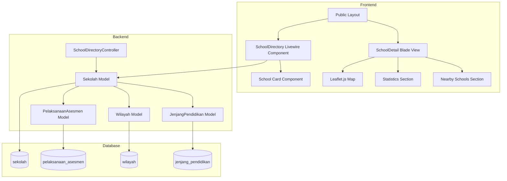

# Design Document: School Directory

## Overview

Fitur Direktori Sekolah adalah halaman publik yang memungkinkan pengguna untuk menjelajahi daftar sekolah dalam format card grid dengan kemampuan pencarian dan filter. Fitur ini terintegrasi dengan sistem yang sudah ada menggunakan Laravel, Livewire, dan Tailwind CSS.

Fitur terdiri dari dua halaman utama:
1. **Halaman Daftar Sekolah** - Menampilkan card grid sekolah dengan search dan filter
2. **Halaman Detail Sekolah** - Menampilkan informasi lengkap, statistik asesmen, peta lokasi, dan sekolah sekitar

## Architecture



## Components and Interfaces

### 1. Routes

```php
// routes/web.php
Route::get('/sekolah', [SchoolDirectoryController::class, 'index'])->name('sekolah.index');
Route::get('/sekolah/{sekolah}', [SchoolDirectoryController::class, 'show'])->name('sekolah.show');
```

### 2. SchoolDirectoryController

```php
class SchoolDirectoryController extends Controller
{
    public function index(): View
    public function show(Sekolah $sekolah): View
}
```

### 3. SchoolDirectory Livewire Component

```php
class SchoolDirectory extends Component
{
    // Properties
    public string $search = '';
    public ?int $wilayahId = null;
    public ?int $jenjangId = null;
    public ?string $status = null;
    public int $perPage = 12;
    
    // Methods
    public function getSchoolsProperty(): LengthAwarePaginator
    public function resetFilters(): void
    public function render(): View
}
```

### 4. SchoolStatisticsService

```php
class SchoolStatisticsService
{
    public function getStatistics(Sekolah $sekolah): array
    public function getAssessmentHistory(Sekolah $sekolah): Collection
    public function getNearbySchools(Sekolah $sekolah, int $limit = 5): Collection
}
```

## Data Models

### Existing Models Used

**Sekolah Model** (existing)
- `id`, `kode_sekolah`, `nama`, `tahun`, `jenjang_pendidikan_id`, `wilayah_id`
- `status_sekolah`, `latitude`, `longitude`, `alamat`
- Relations: `jenjangPendidikan()`, `wilayah()`, `pelaksanaanAsesmen()`

**PelaksanaanAsesmen Model** (existing)
- `jumlah_peserta`, `partisipasi_literasi`, `partisipasi_numerasi`
- `siklus_asesmen_id`, `sekolah_id`

**Wilayah Model** (existing)
- `id`, `nama`, `logo`

**JenjangPendidikan Model** (existing)
- `id`, `kode`, `nama`

### Data Transfer Objects

```php
// Statistics DTO
[
    'total_peserta' => int,
    'avg_literasi' => float,
    'avg_numerasi' => float,
    'total_asesmen' => int,
]

// Assessment History Item
[
    'siklus' => string,
    'jumlah_peserta' => int,
    'partisipasi_literasi' => float,
    'partisipasi_numerasi' => float,
]
```

## Correctness Properties

*A property is a characteristic or behavior that should hold true across all valid executions of a system-essentially, a formal statement about what the system should do. Properties serve as the bridge between human-readable specifications and machine-verifiable correctness guarantees.*

### Property 1: Card displays all required fields
*For any* school in the database, when rendered as a Card_Sekolah, the output SHALL contain the school's name, kode_sekolah, wilayah name, status_sekolah, and jenjang_pendidikan name.
**Validates: Requirements 1.2**

### Property 2: Filter correctness - Search
*For any* search term and school list, all schools returned by the search filter SHALL have either name or kode_sekolah containing the search term (case-insensitive).
**Validates: Requirements 2.1**

### Property 3: Filter correctness - Wilayah
*For any* wilayah filter selection, all schools returned SHALL belong to the selected wilayah_id.
**Validates: Requirements 2.2**

### Property 4: Filter correctness - Jenjang
*For any* jenjang_pendidikan filter selection, all schools returned SHALL have the selected jenjang_pendidikan_id.
**Validates: Requirements 2.3**

### Property 5: Filter correctness - Status
*For any* status_sekolah filter selection (excluding "Semua"), all schools returned SHALL have the selected status_sekolah value.
**Validates: Requirements 2.4**

### Property 6: School count matches filtered results
*For any* combination of filters, the displayed school count SHALL equal the actual number of schools matching those filters.
**Validates: Requirements 1.5**

### Property 7: Statistics calculation - Total peserta
*For any* school, the displayed total_peserta SHALL equal the sum of jumlah_peserta from all related pelaksanaan_asesmen records.
**Validates: Requirements 4.2**

### Property 8: Statistics calculation - Averages
*For any* school with assessment data, the displayed avg_literasi and avg_numerasi SHALL equal the arithmetic mean of partisipasi_literasi and partisipasi_numerasi from all related pelaksanaan_asesmen records.
**Validates: Requirements 4.3**

### Property 9: Nearby schools - Same wilayah
*For any* school, all schools in the "Sekolah Sekitar" list SHALL have the same wilayah_id as the current school.
**Validates: Requirements 5.1**

### Property 10: Nearby schools - Exclusion and limit
*For any* school, the "Sekolah Sekitar" list SHALL NOT contain the current school AND SHALL contain at most 5 schools.
**Validates: Requirements 5.2**

### Property 11: Google Maps link correctness
*For any* school with latitude and longitude, the Google Maps link SHALL contain the correct coordinates in the format `https://www.google.com/maps?q={latitude},{longitude}`.
**Validates: Requirements 3.7**

## Error Handling

| Scenario | Handling |
|----------|----------|
| School not found | Return 404 page |
| No schools match filter | Display "Tidak ada sekolah yang ditemukan" message |
| No assessment data | Display "Belum ada data asesmen" message |
| No coordinates | Display "Lokasi tidak tersedia" instead of map |
| Database error | Log error, display generic error message |

## Testing Strategy

### Property-Based Testing

The project will use **Pest PHP** with **pest-plugin-faker** for property-based testing. Each correctness property will be implemented as a property-based test that generates random inputs and verifies the property holds.

Configuration:
- Minimum 100 iterations per property test
- Use factories for generating test data
- Each test tagged with property reference comment

### Unit Testing

Unit tests will cover:
- SchoolStatisticsService calculations
- Filter logic in Livewire component
- Route accessibility
- View rendering with various data states

### Test Organization

```
tests/
├── Feature/
│   └── SchoolDirectory/
│       ├── SchoolDirectoryPageTest.php
│       ├── SchoolDetailPageTest.php
│       └── SchoolFilterTest.php
└── Unit/
    └── Services/
        └── SchoolStatisticsServiceTest.php
```
